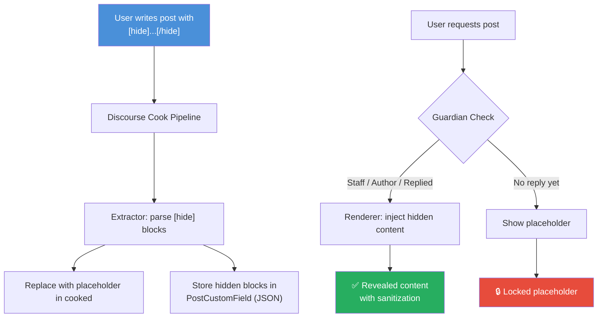
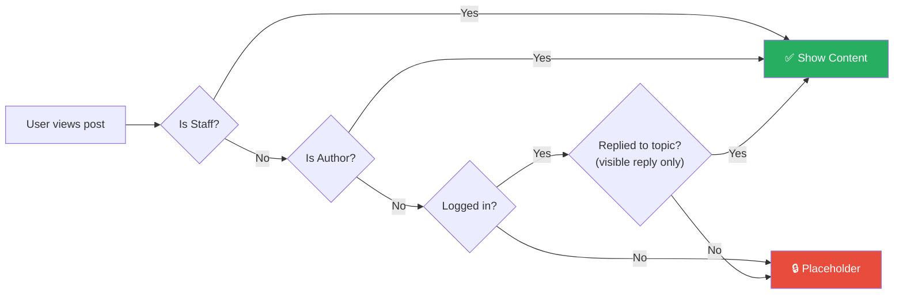
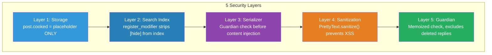

<div align="center">

# discourse-hide

[![Discourse][discourse-shield]][discourse-url]
[![License: MIT][license-shield]][license-url]
[![Version][version-shield]](#)

**[hide]...[/hide]** BBCode for Discourse — Reply to view hidden content

---

[English](#english) | [Chinese](README.zh-CN.md)

</div>

---

<a name="english"></a>

## English

### What is this?

A Discourse plugin that adds `[hide]...[/hide]` BBCode. Content wrapped in these tags is only visible to users who have **replied to the topic**.

### Preview

<table>
<tr>
<td width="50%" align="center">

**Before Reply (Locked)**

```
┌─────────────────────────────┐
│                             │
│    🔒  This content is     │
│    hidden. Reply to this    │
│    topic to reveal it.      │
│                             │
└─────────────────────────────┘
```

</td>
<td width="50%" align="center">

**After Reply (Unlocked)**

```
┌─────────────────────────────┐
│ ┃                           │
│ ┃  Download link:           │
│ ┃  https://example.com/dl   │
│ ┃                           │
│ ┃  Password: s3cretP@ss     │
│ ┃                           │
└─────────────────────────────┘
```

</td>
</tr>
</table>

### Features

| Feature | Description |
|---------|-------------|
| **Reply-to-view** | Hidden content revealed only after user replies |
| **Server-side security** | Hidden content **never** stored in `post.cooked` |
| **Multi-block** | Multiple `[hide]...[/hide]` per post |
| **Staff bypass** | Admins & moderators always see content |
| **Author bypass** | Post author always sees own content |
| **Search protection** | Hidden text stripped from search index |
| **Mobile friendly** | 44px min touch targets, responsive layout |
| **Accessible** | ARIA `role="note"` & `aria-label` on placeholders |
| **Theme compatible** | Discourse CSS custom properties throughout |
| **XSS safe** | `PrettyText.sanitize()` on every injection |

### How It Works



### Visibility Rules



| User Type | Can See? |
|-----------|----------|
| Admin / Moderator | Always |
| Post Author | Always |
| Replied user | Yes |
| Logged-in (no reply) | No |
| Anonymous | No |

> **Note:** Only *visible* replies unlock content — deleted, hidden, or self-deleted replies do not count.

### Installation (Docker)

Discourse officially runs on Docker. Add the plugin to your `app.yml`:

**Step 1 — Edit your container config:**

```bash
cd /var/discourse
nano containers/app.yml
```

**Step 2 — Add the plugin git clone to the `hooks` section:**

```yaml
hooks:
  after_code:
    - exec:
        cd: $home/plugins
        cmd:
          - git clone https://github.com/discourse/docker_manager.git
          - git clone https://github.com/wchiways/discourse-hide.git  # <-- add this line
```

**Step 3 — Rebuild the container:**

```bash
cd /var/discourse
./launcher rebuild app
```

**Step 4 — Enable the plugin:**

Go to **Admin** > **Settings** > search `discourse_hide` > set to **Enabled**

### Usage

Write `[hide]...[/hide]` in any post:

```bbcode
Hey everyone, here's a great resource!

[hide]
Secret download link:
https://example.com/resource.zip

Password: s3cretP@ss
[/hide]

Reply to see the content above!
```

### Architecture

```
discourse-hide/
├── plugin.rb                        # Entry point: hooks, serializer, settings
├── about.json                       # Plugin metadata
├── config/
│   └── settings.yml                 # discourse_hide_enabled setting
├── lib/hide/
│   ├── extractor.rb                 # Extract & replace [hide] blocks
│   ├── guardian_extension.rb        # Reply-based permission check
│   └── renderer.rb                  # Inject content for authorized users
└── assets/
    ├── javascripts/discourse/
    │   └── api-initializers/
    │       └── hide-bbcode.js       # Placeholder UI & post-reply refresh
    └── stylesheets/
        └── hide-bbcode.scss         # Placeholder & revealed styles
```

### Security Model



**Protected outputs** (all receive placeholder only, never hidden content):

- Email notifications & digests
- Topic list excerpts
- Search index
- RSS feeds
- API responses

### Configuration

| Setting | Default | Description |
|---------|---------|-------------|
| `discourse_hide_enabled` | `true` | Enable/disable the plugin |

### Requirements

- Discourse **3.1.0+**
- Docker-based installation (recommended)

---

<div align="center">

## License

MIT

---

Made with ❤️ for the Discourse community

</div>

<!-- Badge links -->
[discourse-shield]: https://img.shields.io/badge/Discourse-3.1%2B-blue?logo=discourse&logoColor=white
[discourse-url]: https://www.discourse.org/
[license-shield]: https://img.shields.io/badge/License-MIT-green.svg
[license-url]: #license
[version-shield]: https://img.shields.io/badge/version-0.1.0-orange
