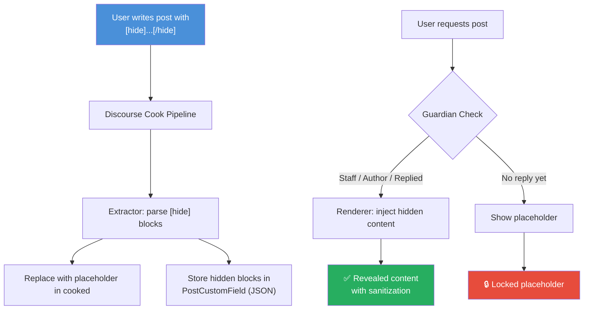
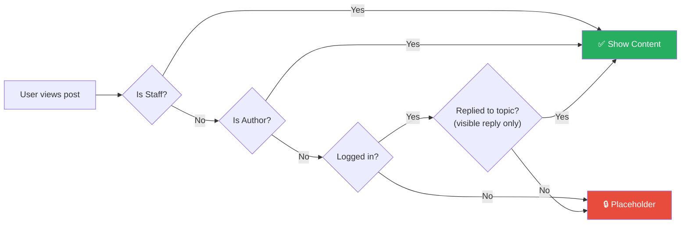
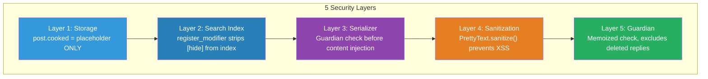
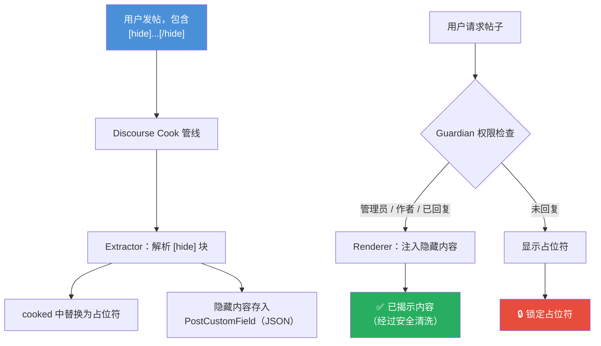
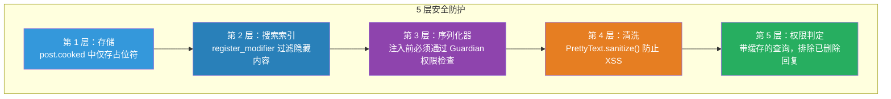

<div align="center">

# discourse-hide

[![Discourse][discourse-shield]][discourse-url]
[![License: MIT][license-shield]][license-url]
[![Version][version-shield]](#)

**[hide]...[/hide]** BBCode for Discourse — Reply to view hidden content

Discourse 回复可见插件 — 回复帖子后才能查看隐藏内容

---

[English](#english) | [中文](#中文)

</div>

---

<a name="english"></a>

## English

### What is this?

A Discourse plugin that adds `[hide]...[/hide]` BBCode. Content wrapped in these tags is only visible to users who have **replied to the topic**.

### Preview

<table>
<tr>
<td width="50%" align="center">

**Before Reply (Locked)**

```
┌─────────────────────────────┐
│                             │
│    🔒  This content is     │
│    hidden. Reply to this    │
│    topic to reveal it.      │
│                             │
└─────────────────────────────┘
```

</td>
<td width="50%" align="center">

**After Reply (Unlocked)**

```
┌─────────────────────────────┐
│ ┃                           │
│ ┃  Download link:           │
│ ┃  https://example.com/dl   │
│ ┃                           │
│ ┃  Password: s3cretP@ss     │
│ ┃                           │
└─────────────────────────────┘
```

</td>
</tr>
</table>

### Features

| Feature | Description |
|---------|-------------|
| **Reply-to-view** | Hidden content revealed only after user replies |
| **Server-side security** | Hidden content **never** stored in `post.cooked` |
| **Multi-block** | Multiple `[hide]...[/hide]` per post |
| **Staff bypass** | Admins & moderators always see content |
| **Author bypass** | Post author always sees own content |
| **Search protection** | Hidden text stripped from search index |
| **Mobile friendly** | 44px min touch targets, responsive layout |
| **Accessible** | ARIA `role="note"` & `aria-label` on placeholders |
| **Theme compatible** | Discourse CSS custom properties throughout |
| **XSS safe** | `PrettyText.sanitize()` on every injection |

### How It Works



### Visibility Rules



| User Type | Can See? |
|-----------|----------|
| Admin / Moderator | Always |
| Post Author | Always |
| Replied user | Yes |
| Logged-in (no reply) | No |
| Anonymous | No |

> **Note:** Only *visible* replies unlock content — deleted, hidden, or self-deleted replies do not count.

### Installation (Docker)

Discourse officially runs on Docker. Add the plugin to your `app.yml`:

**Step 1 — Edit your container config:**

```bash
cd /var/discourse
nano containers/app.yml
```

**Step 2 — Add the plugin git clone to the `hooks` section:**

```yaml
hooks:
  after_code:
    - exec:
        cd: $home/plugins
        cmd:
          - git clone https://github.com/discourse/docker_manager.git
          - git clone https://github.com/wchiways/discourse-hide.git  # <-- add this line
```

**Step 3 — Rebuild the container:**

```bash
cd /var/discourse
./launcher rebuild app
```

**Step 4 — Enable the plugin:**

Go to **Admin** > **Settings** > search `discourse_hide` > set to **Enabled**

### Usage

Write `[hide]...[/hide]` in any post:

```bbcode
Hey everyone, here's a great resource!

[hide]
Secret download link:
https://example.com/resource.zip

Password: s3cretP@ss
[/hide]

Reply to see the content above!
```

### Architecture

```
discourse-hide/
├── plugin.rb                        # Entry point: hooks, serializer, settings
├── about.json                       # Plugin metadata
├── config/
│   └── settings.yml                 # discourse_hide_enabled setting
├── lib/hide/
│   ├── extractor.rb                 # Extract & replace [hide] blocks
│   ├── guardian_extension.rb        # Reply-based permission check
│   └── renderer.rb                  # Inject content for authorized users
└── assets/
    ├── javascripts/discourse/
    │   └── api-initializers/
    │       └── hide-bbcode.js       # Placeholder UI & post-reply refresh
    └── stylesheets/
        └── hide-bbcode.scss         # Placeholder & revealed styles
```

### Security Model



**Protected outputs** (all receive placeholder only, never hidden content):

- Email notifications & digests
- Topic list excerpts
- Search index
- RSS feeds
- API responses

### Configuration

| Setting | Default | Description |
|---------|---------|-------------|
| `discourse_hide_enabled` | `true` | Enable/disable the plugin |

### Requirements

- Discourse **3.1.0+**
- Docker-based installation (recommended)

---

<a name="中文"></a>

## 中文

### 这是什么？

一个 Discourse 插件，添加 `[hide]...[/hide]` BBCode 标签。被标签包裹的内容只有在用户**回复该帖子后**才可见。

### 效果预览

<table>
<tr>
<td width="50%" align="center">

**回复前（锁定状态）**

```
┌─────────────────────────────┐
│                             │
│    🔒  此内容已隐藏         │
│    回复本帖后可见            │
│                             │
└─────────────────────────────┘
```

</td>
<td width="50%" align="center">

**回复后（已解锁）**

```
┌─────────────────────────────┐
│ ┃                           │
│ ┃  下载链接：               │
│ ┃  https://example.com/dl   │
│ ┃                           │
│ ┃  密码：s3cretP@ss         │
│ ┃                           │
└─────────────────────────────┘
```

</td>
</tr>
</table>

### 功能特性

| 特性 | 说明 |
|------|------|
| **回复可见** | 隐藏内容仅在用户回复帖子后显示 |
| **服务端安全** | 隐藏内容**绝不**存储在 `post.cooked` 中 |
| **多块支持** | 同一帖子可使用多个 `[hide]...[/hide]` |
| **管理员穿透** | 管理员和版主始终可见 |
| **作者穿透** | 帖子作者始终可见自己的隐藏内容 |
| **搜索保护** | 隐藏文本从搜索索引中过滤 |
| **移动端适配** | 最小触控区域 44px，响应式布局 |
| **无障碍** | 占位符包含 ARIA `role="note"` 与 `aria-label` |
| **主题兼容** | 全面使用 Discourse CSS 自定义属性 |
| **XSS 防护** | 每次注入均通过 `PrettyText.sanitize()` 清洗 |

### 工作原理



### 可见性规则

| 用户类型 | 能否查看？ |
|---------|-----------|
| 管理员 / 版主 | 始终可见 |
| 帖子作者 | 始终可见 |
| 已回复用户 | 可见 |
| 已登录但未回复 | 不可见 |
| 匿名访客 | 不可见 |

> **注意：** 只有*可见的*回复才能解锁内容——已删除、已隐藏或用户自删的回复不计入。

### 安装（Docker 方式）

Discourse 官方使用 Docker 部署。将插件添加到 `app.yml` 即可：

**第 1 步 — 编辑容器配置文件：**

```bash
cd /var/discourse
nano containers/app.yml
```

**第 2 步 — 在 `hooks` 部分添加插件的 git clone：**

```yaml
hooks:
  after_code:
    - exec:
        cd: $home/plugins
        cmd:
          - git clone https://github.com/discourse/docker_manager.git
          - git clone https://github.com/wchiways/discourse-hide.git  # <-- 添加这一行
```

**第 3 步 — 重建容器：**

```bash
cd /var/discourse
./launcher rebuild app
```

**第 4 步 — 启用插件：**

进入 **管理后台** > **设置** > 搜索 `discourse_hide` > 设为**启用**

### 使用方法

在帖子中使用 `[hide]...[/hide]` 标签：

```bbcode
大家好，分享一个好资源！

[hide]
下载链接：
https://example.com/resource.zip

密码：s3cretP@ss
[/hide]

回复本帖即可查看上方隐藏内容！
```

### 安全模型



**受保护的输出**（均只包含占位符，不会泄露隐藏内容）：

- 邮件通知与摘要
- 帖子列表摘要
- 搜索索引
- RSS 订阅
- API 响应

### 项目结构

```
discourse-hide/
├── plugin.rb                        # 入口：钩子、序列化器、设置
├── about.json                       # 插件元信息
├── config/
│   └── settings.yml                 # discourse_hide_enabled 设置项
├── lib/hide/
│   ├── extractor.rb                 # 抽取并替换 [hide] 块
│   ├── guardian_extension.rb        # 基于回复的权限检查
│   └── renderer.rb                  # 为授权用户注入内容
└── assets/
    ├── javascripts/discourse/
    │   └── api-initializers/
    │       └── hide-bbcode.js       # 占位 UI 与回复后自动刷新
    └── stylesheets/
        └── hide-bbcode.scss         # 占位符与揭示样式
```

### 配置项

| 设置 | 默认值 | 说明 |
|------|--------|------|
| `discourse_hide_enabled` | `true` | 启用/禁用插件 |

### 系统要求

- Discourse **3.1.0** 及以上
- Docker 部署方式（推荐）

---

<div align="center">

## License / 许可证

MIT

---

Made with ❤️ for the Discourse community

</div>

<!-- Badge links -->
[discourse-shield]: https://img.shields.io/badge/Discourse-3.1%2B-blue?logo=discourse&logoColor=white
[discourse-url]: https://www.discourse.org/
[license-shield]: https://img.shields.io/badge/License-MIT-green.svg
[license-url]: #license--许可证
[version-shield]: https://img.shields.io/badge/version-0.1.0-orange
