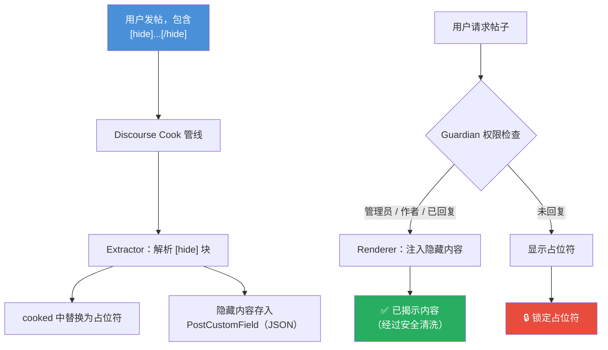

<div align="center">

<a name="readme"></a>

# discourse-hide

[![Discourse][discourse-shield]][discourse-url]
[![License: MIT][license-shield]][license-url]
[![Version][version-shield]](#)

**Discourse 回复可见插件** — 使用 **[hide]...[/hide]** 实现“回复后可见”的隐藏内容

---

[English](README.md) | [中文](#readme)

</div>

---

## 这是什么？

这是一个 Discourse 插件，为帖子新增 `[hide]...[/hide]` BBCode。被标签包裹的内容只有在用户**回复该主题后**才可见。

## 效果预览

<table>
<tr>
<td width="50%" align="center">

**回复前（锁定状态）**

```
┌─────────────────────────────┐
│                             │
│    🔒  此内容已隐藏         │
│    回复本帖后可见            │
│                             │
└─────────────────────────────┘
```

</td>
<td width="50%" align="center">

**回复后（已解锁）**

```
┌─────────────────────────────┐
│ ┃                           │
│ ┃  下载链接：               │
│ ┃  https://example.com/dl   │
│ ┃                           │
│ ┃  密码：s3cretP@ss         │
│ ┃                           │
└─────────────────────────────┘
```

</td>
</tr>
</table>

## 功能特性

| 特性 | 说明 |
|------|------|
| **回复可见** | 隐藏内容仅在用户回复帖子后显示 |
| **服务端安全** | 隐藏内容**绝不**存储在 `post.cooked` 中 |
| **多块支持** | 同一帖子可使用多个 `[hide]...[/hide]` |
| **管理员穿透** | 管理员和版主始终可见 |
| **作者穿透** | 帖子作者始终可见自己的隐藏内容 |
| **搜索保护** | 隐藏文本从搜索索引中过滤 |
| **移动端适配** | 最小触控区域 44px，响应式布局 |
| **无障碍** | 占位符包含 ARIA `role="note"` 与 `aria-label` |
| **主题兼容** | 全面使用 Discourse CSS 自定义属性 |
| **XSS 防护** | 每次注入均通过 `PrettyText.sanitize()` 清洗 |

## 工作原理



## 可见性规则

| 用户类型 | 能否查看？ |
|---------|-----------|
| 管理员 / 版主 | 始终可见 |
| 帖子作者 | 始终可见 |
| 已回复用户 | 可见 |
| 已登录但未回复 | 不可见 |
| 匿名访客 | 不可见 |

> **注意：** 只有*可见的*回复才能解锁内容——已删除、已隐藏或用户自删的回复不计入。

## 安装（Docker 方式）

Discourse 官方使用 Docker 部署。将插件添加到 `app.yml`：

**第 1 步 — 编辑容器配置文件：**

```bash
cd /var/discourse
nano containers/app.yml
```

**第 2 步 — 在 `hooks` 部分添加插件的 git clone：**

```yaml
hooks:
  after_code:
    - exec:
        cd: $home/plugins
        cmd:
          - git clone https://github.com/discourse/docker_manager.git
          - git clone https://github.com/wchiways/discourse-hide.git  # <-- 添加这一行
```

**第 3 步 — 重建容器：**

```bash
cd /var/discourse
./launcher rebuild app
```

**第 4 步 — 启用插件：**

进入 **管理后台** > **设置** > 搜索 `discourse_hide` > 设为**启用**

## 使用方法

在帖子中使用 `[hide]...[/hide]` 标签：

```bbcode
大家好，分享一个好资源！

[hide]
下载链接：
https://example.com/resource.zip

密码：s3cretP@ss
[/hide]

回复本帖即可查看上方隐藏内容！
```

## 项目结构

```
discourse-hide/
├── plugin.rb                        # 入口：钩子、序列化器、设置
├── about.json                       # 插件元信息
├── config/
│   └── settings.yml                 # discourse_hide_enabled 设置项
├── lib/hide/
│   ├── extractor.rb                 # 抽取并替换 [hide] 块
│   ├── guardian_extension.rb        # 基于回复的权限检查
│   └── renderer.rb                  # 为授权用户注入内容
└── assets/
    ├── javascripts/discourse/
    │   └── api-initializers/
    │       └── hide-bbcode.js       # 占位 UI 与回复后自动刷新
    └── stylesheets/
        └── hide-bbcode.scss         # 占位符与揭示样式
```

## 配置项

| 设置 | 默认值 | 说明 |
|------|--------|------|
| `discourse_hide_enabled` | `true` | 启用/禁用插件 |

## 系统要求

- Discourse **3.1.0** 及以上
- Docker 部署方式（推荐）

---

<div align="center">

## 许可证

MIT

</div>

<!-- Badge links -->
[discourse-shield]: https://img.shields.io/badge/Discourse-3.1%2B-blue?logo=discourse&logoColor=white
[discourse-url]: https://www.discourse.org/
[license-shield]: https://img.shields.io/badge/License-MIT-green.svg
[license-url]: #许可证
[version-shield]: https://img.shields.io/badge/version-0.1.0-orange
